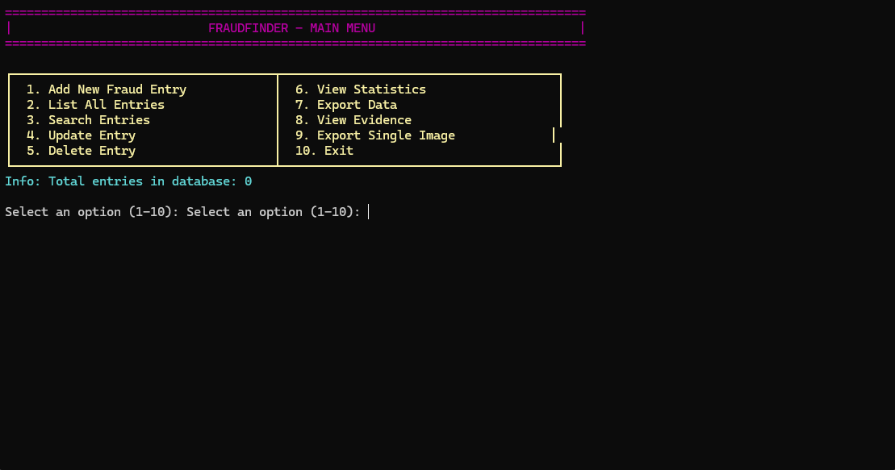

# FraudFinder

A professional console-based fraud tracking and reporting system designed to help communities share and manage information about fraudulent activities across various platforms.

## Preview

## Features

- **Comprehensive Fraud Tracking**: Support for multiple fraud types including scams, phishing, identity theft, investment fraud, romance scams, and tech support scams
- **Multi-Platform Coverage**: Track fraud across Discord, Telegram, WhatsApp, Email, Phone, Websites, and Social Media
- **Evidence Management**: Embed images directly into the database for secure evidence storage
- **Advanced Search**: Search by ID, identifier, fraud type, or platform
- **Data Export**: Export entries to CSV with optional image extraction
- **Statistics Dashboard**: View detailed statistics on fraud patterns
- **Severity Classification**: Categorize threats as Low, Medium, High, or Critical
- **Verification System**: Mark entries as verified for improved data quality

## Installation

### Prerequisites
- SQLite3 development libraries
- C++ compiler with C++17 support
- Windows (currently supported), Linux/macOS support coming soon

### Building from Source
1. Clone the repository
2. Ensure SQLite3 development libraries are installed
3. Compile with your preferred C++ compiler
4. Run the executable

## Usage

Launch the application and navigate through the intuitive console interface:

1. **Add New Entry**: Record fraud incidents with detailed information
2. **View/Search**: Browse and search existing entries
3. **Evidence Management**: Embed and view image evidence
4. **Export Data**: Generate CSV reports with optional image extraction
5. **Statistics**: Analyze fraud patterns and trends

## Database Features

- SQLite database for reliable, portable storage
- Embedded image storage (BLOB) for evidence files
- Automatic indexing for fast searches
- Support for large image files (up to 50MB)

## Security Notes

This tool is designed for legitimate fraud prevention and community protection. All data is stored locally in an SQLite database. Users are responsible for compliance with local laws and privacy regulations when collecting and storing fraud-related information.

## Contributing

This project is in beta phase. Bug reports and feature suggestions are welcome through GitHub issues.

## License

Please check the repository for license information.

## Roadmap

- Linux and macOS compatibility
- GUI interface
- Network sharing capabilities
- Enhanced reporting features
- API integration options

---

**Disclaimer**: This software is provided for legitimate fraud prevention purposes only. Users must comply with applicable laws and regulations regarding data collection and storage.